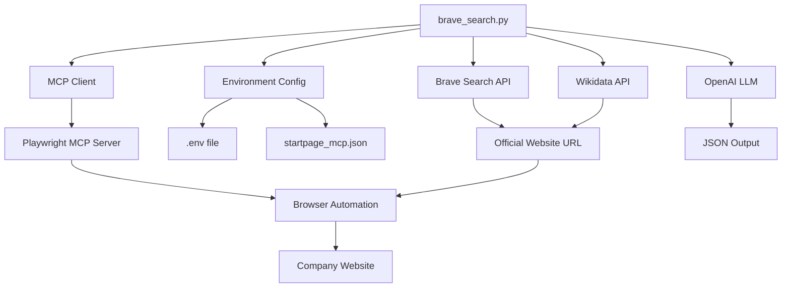

# Technical Documentation - Brave Search Company Agent

## Overview

This document provides detailed technical information about the Brave Search Company Agent, including architecture, implementation details, and advanced configuration options. The agent uses Brave Search API as the primary method to find official company websites, with Wikidata as a fallback, then employs MCP (Model Context Protocol) with Playwright for automated data extraction.

## Architecture

### System Components



The diagram above illustrates the flow for a single company lookup, typically initiated by `brave_search.py` or a single process within `company_processor.py`. The system also includes `company_parallel_processor.py`, which processes multiple companies in parallel, with each parallel process following a similar architecture to the one depicted.

### Technology Stack

- **Python 3.11+**: Main runtime environment
- **httpx**: HTTP client for API requests
- **Brave Search API**: Primary search method for finding company websites
- **Wikidata API**: Fallback search method
- **mcp-use**: MCP client library for Python
- **LangChain**: LLM integration framework
- **OpenAI GPT**: Language model for content analysis
- **Playwright**: Browser automation via MCP server
- **Node.js/npx**: Runtime for Playwright MCP server

## Code Architecture

### Main Components

#### 1. Environment Setup
```python
from dotenv import load_dotenv
from mcp_use import MCPAgent, MCPClient
from mcp_use.logging import Logger
from langchain_openai import ChatOpenAI

# Load environment variables
load_dotenv()

# Enable debug logging
Logger.set_debug(2)
```

#### 2. MCP Client Configuration
```python
# Create MCPClient from config file
client = MCPClient.from_config_file(
    os.path.join(os.path.dirname(__file__), "startpage_mcp.json")
)
```

#### 3. LLM Initialization
```python
# Initialize the OpenAI client
llm = ChatOpenAI(
    model="gpt-4.1-mini",
    temperature=0
)
```

#### 4. Agent Creation
```python
# Create agent with the client
agent = MCPAgent(llm=llm, client=client, max_steps=30)
```

#### 5. Batch Processing
The system provides two scripts for processing multiple companies from a CSV file:

- **Sequential Processing (`company_processor.py`)**:
  Use `company_processor.py` to process companies one after another. This is suitable for smaller lists or when sequential execution is preferred.
  ```bash
  python company_processor.py input.csv output.csv
  ```
  The input file must have `company_number` and `company_name` columns.

- **Parallel Processing (`company_parallel_processor.py`)**:
  For larger datasets, `company_parallel_processor.py` offers significantly faster processing by handling multiple companies concurrently. See component #7 below for more details on its usage and benefits.

#### 6. Shared Search Utilities (`search_common.py`)
This module consolidates common functionalities for finding company URLs, including:
- Querying the Brave Search API (`get_brave_search_candidates`).
- Querying the Wikidata API (`get_wikidata_homepage`).
- Using an LLM to select the best URL from candidates (`select_best_url_with_llm`).
These functions are parameterized to accept API keys and LLM instances directly.

#### 7. Parallel Batch Processing (`company_parallel_processor.py`)
This script is designed for processing a large number of companies from a CSV file concurrently. It utilizes the `multiprocessing` module to distribute the workload across multiple CPU cores, significantly speeding up the data extraction process for large datasets. Each worker process handles a subset of companies, independently performing URL discovery (via `search_common.py`) and data extraction using an `MCPAgent`.

Usage:
```bash
python company_parallel_processor.py input.csv output.csv --workers <num_workers>
```
- `input.csv`: Path to the input CSV file (must contain `company_number` and `company_name` columns).
- `output.csv`: Path where the results will be saved.
- `--workers <num_workers>`: Optional. Number of worker processes to use. Defaults to the number of CPU cores.

## MCP (Model Context Protocol) Integration

### What is MCP?

MCP is a protocol that enables AI models to securely connect to external tools and data sources. In this project, it allows the Python script to control a browser through the Playwright MCP server.

### MCP Server Configuration

The `startpage_mcp.json` file configures the Playwright MCP server:

```json
{
  "mcpServers": {
    "playwright": {
      "command": "npx",
      "args": ["@playwright/mcp@latest"]
    }
  }
}
```

### MCP Communication Flow

1. **Initialization**: MCPClient connects to Playwright server via npx
2. **Tool Discovery**: Client discovers available browser automation tools
3. **Tool Execution**: Agent uses tools to navigate and extract data
4. **Data Return**: Results are passed back through MCP protocol

## Playwright MCP Server Setup

The Brave Search Company Agent uses Playwright’s Model Context Protocol (MCP) server over stdio to drive browser automation. A transient regression in `@playwright/mcp` v0.0.27 mandates pinning to v0.0.26 until upstream fixes the issue.

### 1. Pin MCP Server Version

In your `startpage_mcp.json`, ensure you explicitly request v0.0.26:

```jsonc
{
  "mcpServers": {
    "playwright": {
      "command": "npx",
      "args": ["-y", "@playwright/mcp@0.0.26"]
    }
  }
}
```

> **Why?** v0.0.27 contains a bug that prevents the server from initializing correctly over stdio. Pinning ensures a known-good handshake.

### 2. Install MCP Package & Browsers

Run these commands **once** to install the MCP server and the required Playwright browsers:

```bash
# Install the MCP wrapper globally (optional; local install also works)
npm install -g @playwright/mcp@0.0.26

# Download Chromium (required for browser automation)
npx playwright install chromium
```

* The first command fetches the MCP CLI (≈300 MB download on first run).
* The second command installs the browser binaries Playwright will drive.

### 3. Automatic Initialization in Python

Your Python code, via `mcp_use`, will now launch:

```python
from mcp_use import MCPClient, MCPAgent
from mcp_use.logging import Logger
from langchain_openai import ChatOpenAI

Logger.set_debug(2)  # verbose MCP protocol logging

client = MCPClient.from_config_file("startpage_mcp.json")
llm    = ChatOpenAI(model="gpt-4.1-mini", temperature=0)
agent  = MCPAgent(llm=llm, client=client, max_steps=30)

# When you call agent.run(), mcp_use will:
#  1. spawn `npx @playwright/mcp@0.0.26`
#  2. send a framed initialize request (with Content-Length, protocolVersion, capabilities, clientInfo)
#  3. receive and log the initialize result
#  4. proceed with browser commands
```

You should see in your console:

```
DEBUG → initialize (Content-Length: xxx)
DEBUG ← initialize result ✔
DEBUG Session initialized ✔
```

at which point the agent will drive Playwright without hanging.

### 4. Manual Server Verification (Optional)

If you need to confirm the MCP server is responding correctly outside Python:

1. Create an `init.json` file with a valid LSP initialize payload:

   ```bash
   cat << 'EOF' > init.json
   {"jsonrpc":"2.0","id":0,"method":"initialize","params":{
      "protocolVersion":"1.0.0",
      "capabilities":{},
      "clientInfo":{"name":"mcp_manual_test","version":"1.0.0"}
   }}
   EOF
   ```

2. Send it with proper LSP framing:

   ```bash
   length=$(wc -c < init.json)
   printf 'Content-Length: %d\r\n\r\n' "$length"
   cat init.json \
     | npx -y @playwright/mcp@0.0.26
   ```

3. A successful response will look like:

   ```json
   {"jsonrpc":"2.0","id":0,"result":{"capabilities":{…}}}
   ```

If you see that, the server is healthy and ready for your Python client.

### 5. Troubleshooting

* **No initialize response?**

  * ✔️ Confirm you pinned to `@playwright/mcp@0.0.26`.
  * ✔️ Ensure `npx --version` and `node --version` are v16+ and on your PATH.
  * ✔️ Run `npx playwright install chromium` again to verify browsers are installed.
* **Permission or exec errors on Windows?**

  * In PowerShell run:

    ```powershell
    Set-ExecutionPolicy RemoteSigned -Scope CurrentUser
    ```
  * Or launch your script from CMD rather than Git Bash.
* **Still hanging in Python logs at “Initializing MCP session”?**

  * Upgrade your `mcp_use` client:

    ```bash
    pip install --upgrade mcp_use
    ```
  * Verify your `startpage_mcp.json` contains **no** obsolete flags like `--stdio`.

---

With these steps in place, your MCPAgent will complete its handshake and seamlessly control Playwright for full end-to-end company data extraction.

## Prompt Engineering

### Search Strategy

The agent uses a two-phase approach:

1. **URL Discovery Phase**: 
   - Primary: Brave Search API with query `"{company_name} offizielle Webseite Schweiz"`
   - Fallback: Wikidata API for official website property (P856)
   - Filtering: Excludes social media, job sites, and blacklisted domains

2. **Data Extraction Phase**: 
   - Uses found URL or proceeds without URL if none found
   - Employs German-language prompt for Swiss company focus
   - Extracts specific data points with null handling

### Data Extraction Fields

The prompt specifies exact fields to extract:

```python
prompt = f"""
Du bist ein Web-Agent mit Playwright-Werkzeugen.

Die offizielle Webseite für "{company_name}" wurde als "{root_url_for_prompt if company_url else 'nicht gefunden'}" identifiziert.

Wenn eine URL ({root_url_for_prompt}) vorhanden ist und nicht 'null' oder 'nicht gefunden' lautet:
1. Öffne diese URL: {root_url_for_prompt}
2. Durchsuche diese Seite und relevante Unterseiten (z. B. /about, /unternehmen, /impressum, /geschichte)
   und sammle die unten genannten Fakten.

Wenn KEINE URL gefunden wurde (d.h. als "{root_url_for_prompt}" angegeben ist) ODER Informationen auf der Webseite nicht auffindbar sind, gib für die entsprechenden Felder **null** zurück.

Fakten zu sammeln:
   • Aktueller CEO / Geschäftsführer
   • Gründer (Komma-getrennt bei mehreren)
   • Inhaber (Besitzer der Firma)
   • Aktuelle Mitarbeiterzahl (Zahl oder Bereich, z. B. "200-250")
   • Gründungsjahr (JJJJ)
   • Offizielle Website (die bereits ermittelte Root-URL: "{root_url_for_prompt}")
   • Was macht diese Firma besser als ihre Konkurrenz. (maximal 10 Wörter)
   • Hauptsitz (Adresse des Firmenhauptsitzes)
   • Firmenidentifikationsnummer (meistens im Impressum, z.B. CHE-XXX.XXX.XXX)
   • Haupt-Telefonnummer
   • Haupt-Emailadresse
   • Geschäftsbericht (URL zum PDF, falls vorhanden)
"""
```

### URL Discovery Functions

The core logic for URL discovery now resides in `search_common.py`. Functions such as `get_brave_search_candidates` and `select_best_url_with_llm` are designed to receive necessary API keys or LLM instances as parameters.

#### Brave Search Implementation
```python
def get_brave_search_candidates(company: str, brave_api_key: str, count: int = 5) -> List[Dict[str, Any]]:
    """Fetches company homepage using Brave Search API."""
    headers = {
        "Accept": "application/json",
        "X-Subscription-Token": brave_api_key
    }
    params = {"q": f'"{company}" homepage official site', "count": count, "country": "ch", "search_lang": "de"}
    # Implementation includes candidate filtering and blacklist checking
```

#### Wikidata Fallback Implementation (`get_wikidata_homepage`)
```python
def get_wikidata_homepage(company: str) -> str | None:
    """Fetches company homepage from Wikidata."""
    # 1. Search for entity by company name
    # 2. Fetch P856 (official website) property
    # 3. Validate and filter results
```

## Error Handling and Debugging

### Debug Levels

```python
Logger.set_debug(0)  # No debug output
Logger.set_debug(1)  # INFO level messages
Logger.set_debug(2)  # DEBUG level messages (full verbose)
```

### Common Error Scenarios

#### 1. Brave Search API Failures
- **Cause**: Invalid API key, rate limiting, or network issues
- **Detection**: HTTP status errors or request timeouts
- **Resolution**: Check API key, verify quota limits, ensure network connectivity

#### 2. Wikidata API Failures
- **Cause**: Network issues or API rate limiting
- **Detection**: HTTP errors or JSON parsing failures
- **Resolution**: Implement retry logic, check network connectivity

#### 3. MCP Connection Failures
- **Cause**: npx not available or execution policy issues
- **Detection**: Connection timeout errors
- **Resolution**: Verify npx installation and PowerShell execution policy

#### 4. LLM API Errors
- **Cause**: Invalid API key or rate limiting
- **Detection**: OpenAI authentication errors
- **Resolution**: Check API key and usage limits

#### 5. Browser Automation Failures
- **Cause**: Website changes, network issues, or anti-bot measures
- **Detection**: Playwright timeout or navigation errors
- **Resolution**: Adjust timeouts or update navigation logic

## Performance Considerations

### Execution Time
- **Typical runtime**: 30-60 seconds per company
- **Factors affecting speed**: Website complexity, network latency, LLM response time

### Resource Usage
- **Memory**: ~200-500MB during execution
- **Network**: Moderate bandwidth for page loading and API calls
- **CPU**: Low to moderate usage

### Optimization Strategies

1. **Reduce max_steps**: Lower from 30 to 15-20 for faster execution
2. **Adjust temperature**: Keep at 0 for consistent results
3. **Use faster models**: Consider gpt-3.5-turbo for speed vs accuracy trade-off

## Security Considerations

### API Key Management
- Store keys in `.env` file (never commit to version control) The main scripts (e.g., `brave_search.py`, `company_processor.py`, `company_parallel_processor.py`) are responsible for loading these keys from the `.env` file.
- Shared utility functions, such as those in `search_common.py`, are designed to receive these API keys (and configured LLM instances, where applicable) as parameters from the calling script. This promotes better encapsulation and makes the utility functions more testable and flexible.
- Use environment-specific keys for development/production
- Implement key rotation policies

### Browser Security
- Playwright runs in isolated environment
- No persistent browser data stored
- Automatic cleanup after execution

### Data Privacy
- No company data is stored locally
- All processing happens in memory
- Consider data retention policies for logs

## Customization Options

### Changing Target Search Engine

To use a different search engine, modify the prompt:

```python
# For Google instead of startpage.com
prompt = f"""
Du bist ein Web-Agent mit Playwright-Werkzeugen.

1. Öffne google.com
2. Suche nach: "{company_name} offizielle Webseite Schweiz"
...
"""
```

### Adding New Data Fields

To extract additional information, modify the JSON structure in the prompt:

```python
{{
  "official_website": "<url oder null>",
  "ceo": "<name oder null>",
  "founder": "<name oder null>",
  "owner": "<name oder null>",
  "employees": "<zahl oder null>",
  "founded": "<jahr oder null>",
  "better_then_the_rest": "<kurze beschreibung>",
  "Hauptsitz": "<adresse oder null>",
  "Firmenidentifikationsnummer": "<CHE-... oder null>",
  "HauptTelefonnummer": "<telefon oder null>",
  "HauptEmailAdresse": "<email oder null>",
  "Geschäftsbericht": "<url oder null>"
}}
```

### Using Different LLM Models

#### OpenAI Models
```python
# GPT-4
llm = ChatOpenAI(model="gpt-4", temperature=0)

# GPT-4o (faster)
llm = ChatOpenAI(model="gpt-4o", temperature=0)
```

#### Google Gemini Models
```python
from langchain_google_genai import ChatGoogleGenerativeAI

llm = ChatGoogleGenerativeAI(
    model="gemini-2.5-pro-preview-05-06", 
    temperature=0
)
```

## Monitoring and Logging

### Log Levels
- **INFO**: Basic execution flow
- **DEBUG**: Detailed MCP communication
- **ERROR**: Failures and exceptions

### Log Analysis
Monitor logs for:
- Connection establishment times
- Tool execution success rates
- LLM response quality
- Error patterns

## Deployment Considerations

### Production Environment
- Use production-grade API keys
- Implement proper error handling
- Set up monitoring and alerting
- Consider rate limiting

### Scaling
- Implement queuing for multiple requests
- Use connection pooling for MCP clients
- Consider distributed execution for high volume

### Maintenance
- Regular dependency updates
- Monitor for website structure changes
- Update prompts based on success rates

## API Reference

### Main Function
```python
async def main(company_name: str) -> str
```
**Parameters:**
- `company_name`: Name of the company to search for

**Returns:**
- JSON string with company information

### Configuration Files

#### startpage_mcp.json
```json
{
  "mcpServers": {
    "playwright": {
      "command": "npx",
      "args": ["@playwright/mcp@latest"],
      "env": {
        "DISPLAY": ":1"  // Optional for headless environments
      }
    }
  }
}
```

#### .env
```env
OPENAI_API_KEY=sk-...
BRAVE_API_KEY=BSA...  # Required for primary search
GOOGLE_API_KEY=AIza...  # Optional
```

## Testing

### Unit Testing
```python
import pytest
import asyncio
from brave_search import main

@pytest.mark.asyncio
async def test_company_search():
    result = await main("Test Company")
    assert result is not None
    # Add more assertions
```

### Integration Testing
- Test with known companies
- Verify JSON structure
- Check for null handling

### Performance Testing
- Measure execution time
- Test with various company types
- Monitor resource usage

## Troubleshooting Guide

### Step-by-Step Debugging

1. **Verify Environment**
   ```bash
   python --version  # Should be 3.11+
   node --version    # Should be v16+
   npx --version     # Should show version
   ```

2. **Test MCP Connection**
   ```python
   from mcp_use import MCPClient
   client = MCPClient.from_config_file("startpage_mcp.json")
   # Should connect without errors
   ```

3. **Test LLM Connection**
   ```python
   from langchain_openai import ChatOpenAI
   llm = ChatOpenAI(model="gpt-4.1-mini")
   response = llm.invoke("Hello")
   print(response.content)
   ```

4. **Enable Verbose Logging**
   ```python
   Logger.set_debug(2)
   ```

### Common Solutions

| Error | Solution |
|-------|----------|
| `ModuleNotFoundError` | Install missing packages with pip |
| `PowerShell execution policy` | Run `Set-ExecutionPolicy RemoteSigned` |
| `OpenAI authentication` | Check API key in .env file |
| `MCP connection timeout` | Verify npx and internet connection |
| `Browser automation fails` | Check website accessibility |

### MCPAgent Browser Session Hangs

If the crawler hangs at "creating new ones…" when initializing the MCPAgent's browser session, follow these steps:

1. **Install Playwright and browsers**

   * Ensure the Python package is installed:

     ```bash
     pip install playwright
     ```
   * Install browser binaries (from a plain CMD prompt in your venv):

     ```bat
     playwright install
     ```
   * Confirm installation:

     ```bat
     playwright --version
     playwright install --help
     ```

2. **Test Playwright in isolation**
   Create `pw_test.py`:

   ```python
   import asyncio
   from playwright.async_api import async_playwright

   async def main():
       async with async_playwright() as p:
           browser = await p.chromium.launch()
           page = await browser.new_page()
           await page.goto("https://example.com")
           print("PAGE TITLE:", await page.title())
           await browser.close()

   if __name__ == "__main__":
       asyncio.run(main())
   ```

   Run it:

   ```bash
   python pw_test.py
   ```

   You should see:

   ```
   PAGE TITLE: Example Domain
   ```

3. **Shell/Policy issues on Windows**

   * If PowerShell blocks activation scripts, use the `.bat` activator in CMD:

     ```bat
     venv312\Scripts\activate.bat
     ```
   * Or temporarily relax PowerShell policy:

     ```powershell
     Set-ExecutionPolicy -Scope Process -ExecutionPolicy RemoteSigned
     .\venv312\Scripts\Activate.ps1
     ```

4. **Add a timeout to MCPAgent** (optional)
   To prevent indefinite hangs, wrap the agent call:

   ```python
   import asyncio

   try:
       result = await asyncio.wait_for(
           agent.run(prompt, max_steps=30),
           timeout=300
       )
   except asyncio.TimeoutError:
       # handle timeout
   ```

With these steps, Playwright will be able to launch Chromium and the crawler will proceed past the startup hang. Feel free to adjust logging levels or reuse the agent across multiple companies to optimize performance.

## File Structure

A brief overview of the key files and directories in the project:

```
BraveWebCrawler/
├── .env                     # Environment variables (API keys, etc.) - Not version controlled
├── .gitignore               # Specifies intentionally untracked files that Git should ignore
├── brave_search.py          # CLI script for single company search and data extraction
├── company_processor.py     # Script for batch processing companies from a CSV file sequentially
├── company_parallel_processor.py # Script for batch processing companies from a CSV file in parallel
├── search_common.py         # Common utility functions for URL discovery (Brave, Wikidata, LLM selection)
├── startpage_mcp.json       # Configuration for the Playwright MCP server
├── pyproject.toml           # Project metadata and build system configuration (PEP 518)
├── requirements.txt         # Python package dependencies
├── README.md                # User-facing documentation: overview, setup, usage
├── DOCUMENTATION.md         # Detailed technical documentation (this file)
├── brave_search_agent.egg-info/ # Packaging metadata generated by setuptools
└── __pycache__/             # Python bytecode cache
```

(Note: Some generated files like `__pycache__` and `.egg-info` are typically gitignored but listed for completeness of what might be seen locally.)

## Future Enhancements

### Planned Features
- Support for multiple search engines
- Result caching and storage
- Web interface for easier usage
- Multi-language support

### Completed Features
- Batch processing via `company_processor.py`

### Technical Improvements
- Async processing for better performance
- Better error recovery mechanisms
- Enhanced data validation
- Improved prompt engineering

## Contributing

### Development Setup
1. Fork the repository
2. Create virtual environment
3. Install development dependencies
4. Run tests before submitting changes

### Code Standards
- Follow PEP 8 style guidelines
- Add type hints where appropriate
- Include docstrings for functions
- Write tests for new features

### Pull Request Process
1. Create feature branch
2. Implement changes with tests
3. Update documentation
4. Submit pull request with description
