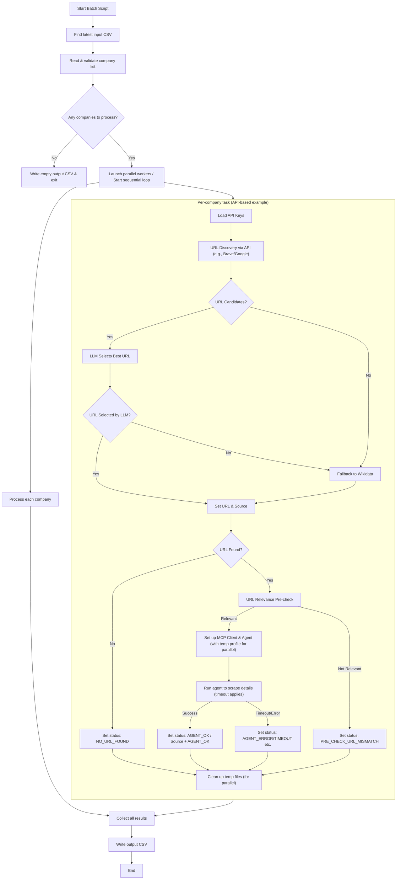

```ascii
              \  .--~~~~~~~~~~~~~~~~~~--.  /
               \/                        \/
               |                          |
               |                          |
               |                          |
               |    C  R  A  W  L  E  R   |
               |                          |
                \                        /
                 `--~~~~~~~~~~~~~~~~~~--'
          \   \   \   \      ||      /   /   /   /
           \   \   \   \     ||     /   /   /   /
            \   \   \   \    ||    /   /   /   /
             *------------*--::--*------------*
            /   /   /   /    ||    \   \   \   \
           /   /   /   /     ||     \   \   \   \
          /   /   /   /      ||      \   \   \   \
   <<==================================================>>
          \   \   \   \      ||      /   /   /   /
           \   \   \   \     ||     /   /   /   /
            \   \   \   \    ||    /   /   /   /
             *------------*--::--*------------*
            /   /   /   /    ||    \   \   \   \
           /   /   /   /     ||     \   \   \   \
          /   /   /   /      ||      \   \   \   \
                 .--~~~~~~~~~~~~~~~~~~--.
                     (  COMPANY-DATA  )         \   
                 `--~~~~~~~~~~~~~~~~~~--'
```

# Technical Documentation - Company Data Extraction Agent

## Overview

This document provides detailed technical information about the Company Data Extraction Agent, a suite of Python scripts designed to find official company websites and extract key information. The system supports multiple strategies for URL discovery, including:

1.  **Brave Search API:** Primary method, with Wikidata as a fallback.
2.  **Google Custom Search API:** Primary method, with Wikidata as a fallback.
3.  **Agent-driven Startpage.com Search:** The agent itself performs a search on Startpage.com to find the company website.

Once a potential URL is identified (or if the agent is tasked to find one), an MCP (Model Context Protocol) enabled agent using Playwright and a Large Language Model (LLM) like OpenAI's GPT attempts to navigate the website and extract predefined data points. The system offers scripts for single company processing, sequential batch processing, and parallel batch processing for each search strategy.

## Architecture

### Core Workflow

The general workflow involves:
1.  **Input:** Reading a list of companies from a CSV file (for batch processing).
2.  **URL Discovery (Strategy-dependent):**
    *   **API-based (Brave/Google):** Query the respective search API, use an LLM to select the best candidate URL from the results, and potentially fall back to Wikidata if no suitable URL is found. A pre-check for URL relevance against the company name is performed.
    *   **Agent-driven (Startpage):** The agent is directly instructed to use Startpage.com to find the official website.
3.  **Agent Processing:** An MCP agent, controlling a Playwright-driven browser, navigates to the identified/found URL. It attempts to confirm the website's relevance and extracts specified company details (e.g., founding year, address, contact info). This step has a configurable timeout.
4.  **Output:** Results, including extracted data and a `processing_status`, are written to an output CSV file.

### System Components Diagram (Illustrative for API-based flow)


*Note: The Startpage-based flow simplifies the "URL Discovery" part, as the agent handles it directly.*

### Technology Stack

-   **Python 3.11+**: Main runtime environment.
-   **httpx**: HTTP client for API requests.
-   **Brave Search API**: For `brave_search.py`, `brave_processor.py`, `brave_parallel_processing.py`.
-   **Google Custom Search API**: For `google_search.py`, `google_parallel_processing.py`.
-   **Wikidata API**: Fallback search method for Brave and Google API scripts.
-   **Startpage.com**: Used by the agent in `startpage_parallel_processing.py`. (Only works when headless = False)
-   **mcp-use**: MCP client library for Python. => https://github.com/mcp-use/mcp-use
-   **LangChain**: LLM integration framework.
-   **OpenAI GPT (e.g., gpt-4.1-mini)**: Language model for URL selection and agent-based data extraction.
-   **Playwright**: Browser automation via MCP server. => https://github.com/microsoft/playwright-mcp
-   **Node.js/npx**: Runtime for Playwright MCP server.
-   **dotenv**: For managing environment variables.
-   **psutil**: For managing processes during cleanup in parallel scripts.

## Code Architecture

### Main Processing Scripts

The project includes several primary scripts, categorized by their URL discovery strategy and processing mode:

**1. Brave Search Based:**
    *   `brave_search.py`: CLI script for processing a single company using Brave Search API, then Wikidata, followed by agent extraction.
    *   `brave_processor.py`: Sequentially processes companies from a CSV using Brave Search API/Wikidata. Each company is processed in a separate `multiprocessing.Process` with a timeout.
    *   `brave_parallel_processing.py`: Processes companies from a CSV in parallel using `multiprocessing.Pool`, with Brave Search API/Wikidata for URL discovery. Features isolated browser profiles and dynamic MCP configurations per worker.

**2. Google Search Based:**
    *   `google_search.py`: CLI script for a single company using Google Custom Search API, then Wikidata.
    *   `google_parallel_processing.py`: Processes companies from a CSV in parallel using `multiprocessing.Pool`, with Google Custom Search API for URL discovery. Also uses isolated profiles and dynamic MCP configs. The agent in this script is typically given a pre-selected URL to process. Headless mode is enabled by default (`--headless=new`).

**3. Startpage Agent Based:**
    *   `startpage_parallel_processing.py`: Processes companies from a CSV in parallel. Unlike other scripts, this one tasks the agent to directly use Startpage.com to find the company URL and then extract data. It does not use Brave/Google/Wikidata APIs for initial URL discovery.

### Shared Modules and Concepts

*   **`search_common.py`**:
    *   `get_brave_search_candidates()`: Fetches and pre-processes results from Brave Search API.
    *   `get_Google_Search_candidates()`: Fetches and pre-processes results from Google Custom Search API.
    *   `get_wikidata_homepage()`: Fetches homepage URL from Wikidata.
    *   `select_best_url_with_llm()`: Uses an LLM to choose the best URL from a list of candidates (used by Brave and Google scripts).
    *   `is_url_relevant_to_company()`: Performs a quick pre-check on a URL's relevance before full agent processing (used by API-based scripts).
    *   `BLACKLIST`: A set of domains to ignore during URL discovery.

*   **Environment Setup (`.env`)**:
    Requires API keys:
    ```env
    OPENAI_API_KEY=sk-...
    BRAVE_API_KEY=BSA...        # For Brave Search scripts
    GOOGLE_API_KEY=AIza...      # For Google Search scripts
    GOOGLE_CX=your_cx_id        # For Google Search scripts (Custom Search Engine ID)
    ```

*   **LLM Initialization**:
    Typically uses `ChatOpenAI` from `langchain_openai` with a model like "gpt-4.1-mini".
    ```python
    from langchain_openai import ChatOpenAI
    # ...
    llm = ChatOpenAI(model="gpt-4.1-mini", temperature=0, api_key=os.getenv("OPENAI_API_KEY"))
    ```

*   **MCP Agent Creation**:
    An `MCPAgent` is created with an LLM and an `MCPClient`.
    ```python
    from mcp_use import MCPAgent, MCPClient
    # ...
    # Client configuration varies (see MCP Server Configuration section)
    client = MCPClient.from_config_file(mcp_config_path)
    agent = MCPAgent(llm=llm, client=client, max_steps=30) # max_steps can vary
    ```

*   **Agent Prompts**:
    Each script tailors the prompt for the agent. Key variations:
    *   **API-based scripts (Brave/Google single/parallel):** The prompt usually provides an already identified `root_url_for_prompt` and asks the agent to verify and extract data from it. Some parallel versions include instructions for the agent to use Startpage as a fallback if the provided URL is bad.
    *   **`startpage_parallel_processing.py`:** The prompt instructs the agent to go to Startpage.com, search for the company, identify the official website, and then extract data.
    *   All prompts request data in a specific JSON format.

*   **Output CSV**:
    All batch processing scripts generate a CSV file with columns for `company_number`, `company_name`, the `EXPECTED_JSON_KEYS`, and a `PROCESSING_STATUS_COLUMN`.
    *   `EXPECTED_JSON_KEYS`: `official_website`, `founded`, `Hauptsitz`, `Firmenidentifikationsnummer`, `HauptTelefonnummer`, `HauptEmailAdresse`, `Geschäftsbericht`, `extracted_company_name`.
    *   `PROCESSING_STATUS_COLUMN`: Provides detailed status of processing for each company (e.g., `Brave Search + LLM (AGENT_OK)`, `NO_URL_FOUND`, `PRE_CHECK_URL_MISMATCH`, `AGENT_PROCESSING_TIMEOUT`, `Google Search_LLM_NO_URL_SELECTED`, `Startpage Agent (AGENT_NO_URL_FOUND)`).

*   **Timeout**:
    Agent processing for each company is subject to a timeout, typically `AGENT_PROCESSING_TIMEOUT = 120` seconds in batch scripts.

*   **Parallel Processing Specifics**:
    *   Scripts like `brave_parallel_processing.py`, `google_parallel_processing.py`, and `startpage_parallel_processing.py` use `multiprocessing.Pool` for true parallelism.
    *   They create temporary, isolated Playwright user data directories for each worker process to prevent interference.
    *   Dynamic MCP launcher configurations are generated per worker.
    *   Window positioning for non-headless browsers is often calculated based on worker PID to stagger windows.
    *   `google_parallel_processing.py` defaults to headless mode (`headless: True`, using `--headless=new`). `brave_parallel_processing.py` and `startpage_parallel_processing.py` typically run with `headless: False`.
    *   Robust cleanup mechanisms (`rmtree_with_retry`, `kill_chrome_processes_using`) are implemented.

### Usage Examples

*   **Single Company (Brave Search):**
    ```bash
    python BraveWebCrawler/brave_search.py "Company Name AG"
    ```
*   **Single Company (Google Search):**
    ```bash
    python BraveWebCrawler/google_search.py "Another Company GmbH"
    ```
*   **Sequential Batch Processing (Brave Search):**
    ```bash
    python BraveWebCrawler/brave_processor.py output_brave_sequential.csv
    ```
    (Input CSV is automatically detected from `input/` directory)

*   **Parallel Batch Processing (Brave Search):**
    ```bash
    python BraveWebCrawler/brave_parallel_processing.py output_brave_parallel.csv --workers 4
    ```
*   **Parallel Batch Processing (Google Search):**
    ```bash
    python BraveWebCrawler/google_parallel_processing.py output_google_parallel.csv --workers 4
    ```
*   **Parallel Batch Processing (Startpage Agent Search):**
    ```bash
    python BraveWebCrawler/startpage_parallel_processing.py output_startpage_parallel.csv --workers 4
    ```

## MCP (Model Context Protocol) Integration

### MCP Server Configuration

The project uses different MCP launcher configurations:

1.  **`sequential_mcp_config.json` (for single-threaded/simple scripts):**
    Used by `brave_search.py`, `google_search.py`, and `brave_processor.py` (within its child processes).
    ```json
    {
      "mcpServers": {
        "playwright": {
          "command": "npx",
          "args": ["-y", "@playwright/mcp@0.0.26"]
        }
      }
    }
    ```
    *(Note: Pinned version `@playwright/mcp@0.0.26` for stability).*

2.  **`parallel_mcp_launcher.json` (template for parallel processing):**
    Base template for `brave_parallel_processing.py`, `google_parallel_processing.py`, and `startpage_parallel_processing.py`.
    ```json
    {
      "mcpServers": {
        "playwright": {
          "command": "npx",
          "args": [
            "-y", "@playwright/mcp@0.0.26",
            "--config", "./mcp-config.json" // Placeholder
          ]
        }
      }
    }
    ```
    The `./mcp-config.json` placeholder is dynamically replaced by the parallel processing scripts with the actual path to a worker-specific `runtime-playwright-config.json`.

3.  **Dynamic Configuration for Parallel Processing:**
    Parallel scripts (`*_parallel_processing.py`) create two configuration files per worker in a unique temporary directory:
    *   **`runtime-playwright-config.json`**: Specifies `browser.userDataDir` (the unique temp directory) and `browser.launchOptions` (including `headless` status and window positioning arguments for non-headless mode).
        Example for `brave_parallel_processing.py` (non-headless):
        ```json
        // Example content for runtime-playwright-config.json
        {
          "browser": {
            "userDataDir": "C:\\path\\to\\temp\\mcp_playwright_profile_PID_TIMESTAMP",
            "launchOptions": {
              "headless": false,
              "args": [
                "--disable-breakpad",
                "--disable-extensions",
                "--window-position=0,0", // Dynamically calculated
                "--window-size=800,600"  // Dynamically calculated
              ]
            }
          }
        }
        ```
        Example for `google_parallel_processing.py` (headless):
        ```json
        {
          "browser": {
            "userDataDir": "C:\\path\\to\\temp\\mcp_playwright_profile_PID_TIMESTAMP",
            "launchOptions": {
              "headless": true,
              "args": ["--headless=new"]
            }
          }
        }
        ```
    *   **`runtime-mcp-launcher.json`**: A copy of `parallel_mcp_launcher.json`, but its `--config` argument points to the worker's generated `runtime-playwright-config.json`.

    The `MCPClient` in each worker process uses its unique `runtime-mcp-launcher.json`.
    This approach of using a unique, temporary `userDataDir` for each worker effectively creates **isolated browser sessions**. This prevents interference between parallel tasks and ensures that each company is processed in a clean environment, as opposed to using a persistent browser profile that might carry over state (cookies, cache, etc.) between sessions. Temporary directories and files are cleaned up after processing.

## Playwright MCP Server Setup

The agent uses Playwright’s MCP server, which allows the LLM to interact with web pages through structured data from Playwright's accessibility tree (this is the default "Snapshot Mode", which is fast and doesn't rely on visual interpretation of screenshots). Pinning to `@playwright/mcp@0.0.26` is recommended for this project due to observed stability with this version.

The Playwright MCP server itself supports numerous command-line arguments for configuration (e.g., `--headless`, `--user-data-dir`, `--isolated`, `--browser`). However, this project primarily configures the browser behavior (like headless state, user data directory for isolation, and launch arguments) through the dynamically generated `runtime-playwright-config.json` file. This JSON configuration is then passed to the `npx @playwright/mcp@0.0.26` command via its `--config` argument, as detailed in the "MCP Server Configuration" section.
This method provides a structured way to manage complex configurations per worker in parallel processing scenarios.

### 1. Pin MCP Server Version
Ensure MCP launcher JSON files explicitly request v0.0.26 as shown in the "MCP Server Configuration" section.

### 2. Install MCP Package (globally or per project)
```bash
npm install -g @playwright/mcp@0.0.26
# or for a project-local install (if npx will find it):
# npm install @playwright/mcp@0.0.26
```

### 3. Install Playwright Browsers
(Using PowerShell or cmd.exe in your activated Python virtual environment)
```bash
python -m playwright install
```

### 4. Automatic Initialization in Python
The `MCPClient.from_config_file(...)` method handles launching the MCP server based on the provided JSON configuration.

### 5. Troubleshooting
*   Confirm pinning to `@playwright/mcp@0.0.26`.
*   Ensure `npx` and `node` (v18+ recommended, as per Playwright MCP guidelines) are on PATH.
*   Verify Playwright browsers are installed (`python -m playwright install`).
*   Check PowerShell execution policy if on Windows (`Set-ExecutionPolicy -Scope Process -ExecutionPolicy RemoteSigned`).
*   Upgrade `mcp_use` (`pip install --upgrade mcp_use`).
*   Ensure MCP launcher JSONs are correctly formatted.

## File Structure

```
BraveWebCrawler/
├── .env                     # Environment variables (API keys, etc.)
├── .gitignore               # Specifies intentionally untracked files
├── brave_search.py          # CLI script for single company (Brave Search)
├── brave_processor.py       # Script for sequential batch processing (Brave Search)
├── brave_parallel_processing.py # Script for parallel batch processing (Brave Search)
├── google_search.py         # CLI script for single company (Google Search)
├── google_parallel_processing.py # Script for parallel batch processing (Google Search)
├── startpage_parallel_processing.py # Script for parallel batch processing (Startpage Agent Search)
├── search_common.py         # Common URL discovery and utility functions
├── sequential_mcp_config.json # MCP config for single-threaded/simple scripts
├── parallel_mcp_launcher.json # Template MCP config for parallel scripts
├── pyproject.toml           # Project metadata (if used)
├── requirements.txt         # Python package dependencies
├── README.md                # User-facing documentation
├── DOCUMENTATION.md         # Detailed technical documentation (this file)
├── BraveWebCrawler/         # Main package directory (if structured as such)
├── input/                   # Directory for input files
│   └── input.csv            # Example input file
├── venv312/                 # Python virtual environment (example name)
└── ... (other generated files like __pycache__, .egg-info)
```

## API Reference (Key Functions)

### `brave_search.py` / `google_search.py`
```python
async def main(company_name: str) -> None # Output is printed
```
Usage: `python BraveWebCrawler/brave_search.py "Company Name"`

### `brave_processor.py`
```python
def console_main() -> None
```
Usage: `python BraveWebCrawler/brave_processor.py output.csv` (Input from `input/`)

### `*_parallel_processing.py` (Brave, Google, Startpage)
```python
def console_main() -> None
```
Usage: `python BraveWebCrawler/brave_parallel_processing.py output.csv --workers <num>`

### `search_common.py`
```python
def get_brave_search_candidates(company: str, brave_api_key: str, count: int = 5) -> List[Dict[str, Any]]
async def get_Google_Search_candidates(company_name: str, api_key: str, cx: str, count: int = 5) -> List[Dict[str, Any]]
def get_wikidata_homepage(company: str) -> str | None
def select_best_url_with_llm(company_name: str, search_results: List[Dict[str, Any]], llm: ChatOpenAI) -> str | None
async def is_url_relevant_to_company(url: str, company_name: str, client: httpx.AsyncClient) -> bool
```

## Testing
*   Unit tests for functions in `search_common.py`.
*   Integration tests for individual scripts with mock APIs and a mock MCP server.
*   End-to-end tests with a small sample `input.csv` and live APIs (use with caution regarding costs).

## Troubleshooting Guide

#### Install the Playwright browsers

> **Important:** The Playwright CLI can hang or misbehave in Git-Bash/MINGW64. Use PowerShell or cmd.exe for this step.

1.  **Activate your virtual environment**
    Make sure you’re inside your project folder (where `venv312` or your venv directory lives), then run _exactly one_ of these, depending on your shell:

    *   **PowerShell**
        ```powershell
        # (just once per session, to allow scripts)
        Set-ExecutionPolicy -Scope Process -ExecutionPolicy RemoteSigned

        # activate venv (adjust path if your venv is named differently)
        .\venv312\Scripts\Activate.ps1
        ```
    *   **Command Prompt (cmd.exe)**
        ```cmd
        venv312\Scripts\activate.bat
        ```
    *   **Git Bash / WSL / other POSIX-like shells**
        ```bash
        source venv312/Scripts/activate
        ```
    After activation you should see `(venv312)` (or your venv name) at the start of your prompt.

2.  **Install the browsers**
    Now that your venv is active in PowerShell or cmd.exe, run:
    ```bash
    python -m playwright install
    ```
    This will download the Chromium, Firefox, and WebKit binaries that Playwright needs.

3.  **Verify the installation**
    ```bash
    playwright --version
    # or to check specific browser versions if needed:
    # playwright print-driver-version
    ```
    If those commands print help text or a version number, you’re good to go!

Common Issues:
*   **API Key Errors**: Ensure `.env` file is present in the correct location (usually the root of `BraveWebCrawler` or where the script is run from) and contains valid, correctly named API keys.
*   **MCP Server Fails to Start**: Check Node.js/npx installation, Playwright version pinning, and console logs for errors.
*   **Permissions**: For temporary directory creation/deletion or PowerShell script execution.
*   **Timeouts**: `AGENT_PROCESSING_TIMEOUT` might need adjustment for complex websites or slow network conditions.
*   **LLM Errors**: Check OpenAI API key, model availability, and potential rate limits.

## Future Enhancements
*   More sophisticated URL relevance checking.
*   Support for other search engines or data sources.
*   Advanced error handling and retry mechanisms.
*   Dashboard for monitoring batch jobs.
*   Configuration for `max_steps` for the agent per script.
*   Option to configure headless mode via command-line argument for parallel scripts.
