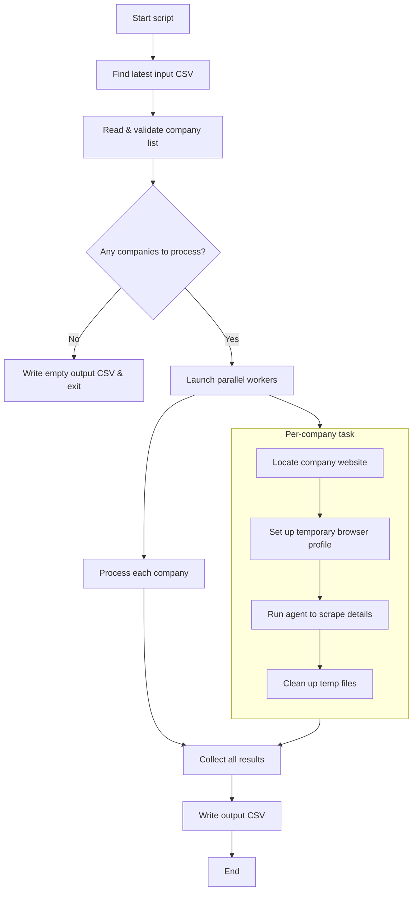

# Technical Documentation - Brave Search Company Agent

## Overview

This document provides detailed technical information about the Brave Search Company Agent, including architecture, implementation details, and advanced configuration options. The agent uses Brave Search API as the primary method to find official company websites, with Wikidata as a fallback, then employs MCP (Model Context Protocol) with Playwright for automated data extraction.

## Architecture

### System Components



The diagram above illustrates the system architecture.
- **Core Logic**: Python scripts (`brave_search.py`, `company_processor.py`, `company_parallel_processor.py`) orchestrate the process, utilizing Brave Search API, Wikidata API, OpenAI LLM, and environment configurations from `.env`.
- **MCP Interaction**: An `MCPClient` within the Python scripts communicates with a `Playwright MCP Server`.
- **Sequential Processing (`brave_search.py`, `company_processor.py`)**: The `MCPClient` is configured using `sequential_mcp_config.json`, which directly instructs how to launch the Playwright MCP server.
- **Parallel Processing (`company_parallel_processor.py`)**:
    - It uses `parallel_mcp_launcher.json` as a template.
    - For each worker process, it dynamically creates:
        1.  `runtime-playwright-config.json`: Specifies a unique `userDataDir` for browser isolation and other Playwright settings (e.g., headless mode).
        2.  `runtime-mcp-launcher.json`: A copy of the template, but its `--config` argument is updated to point to the worker's specific `runtime-playwright-config.json`.
    - The `MCPClient` in each worker then uses its unique `runtime-mcp-launcher.json` to connect to an isolated Playwright MCP server instance.
- **Browser Automation**: The Playwright MCP server controls browser instances for website interaction and data extraction.
- **Output**: The process results in a JSON output containing company information.

### Technology Stack

- **Python 3.11+**: Main runtime environment
- **httpx**: HTTP client for API requests
- **Brave Search API**: Primary search method for finding company websites
- **Wikidata API**: Fallback search method
- **mcp-use**: MCP client library for Python
- **LangChain**: LLM integration framework
- **OpenAI GPT**: Language model for content analysis
- **Playwright**: Browser automation via MCP server
- **Node.js/npx**: Runtime for Playwright MCP server

## Code Architecture

### Main Components

#### 1. Environment Setup
```python
from dotenv import load_dotenv
from mcp_use import MCPAgent, MCPClient
from mcp_use.logging import Logger
from langchain_openai import ChatOpenAI

# Load environment variables
load_dotenv()

# Enable debug logging
Logger.set_debug(1) # Or 2 for verbose
```

#### 2. MCP Client Configuration
For single-threaded scripts like `brave_search.py` or `company_processor.py`:
```python
# Create MCPClient from config file
client = MCPClient.from_config_file(
    os.path.join(os.path.dirname(__file__), "sequential_mcp_config.json")
)
```
For `company_parallel_processor.py`, the client configuration is dynamic (see "MCP Server Configuration" below).

#### 3. LLM Initialization
```python
# Initialize the OpenAI client
llm = ChatOpenAI(
    model="gpt-4.1-mini",
    temperature=0
)
```

#### 4. Agent Creation
```python
# Create agent with the client
agent = MCPAgent(llm=llm, client=client, max_steps=30)
```

#### 5. Batch Processing
The system provides two scripts for processing multiple companies from a CSV file:

- **Sequential Processing (`company_processor.py`)**:
  Processes companies one after another. Uses `sequential_mcp_config.json`.
  ```bash
  python company_processor.py input.csv output.csv
  ```
  The input file must have `company_number` and `company_name` columns.

- **Parallel Processing (`company_parallel_processor.py`)**:
  Offers significantly faster processing by handling multiple companies concurrently using dynamically generated MCP configurations for isolation.
  ```bash
  python company_parallel_processor.py input.csv output.csv --workers <num_workers>
  ```

#### 6. Shared Search Utilities (`search_common.py`)
This module consolidates common functionalities for finding company URLs.

#### 7. Parallel Batch Processing (`company_parallel_processor.py`)
This script utilizes `multiprocessing` and a dynamic MCP configuration strategy to process companies in parallel, ensuring each Playwright instance is isolated.

Usage:
```bash
python company_parallel_processor.py input.csv output.csv --workers <num_workers>
```
- `input.csv`: Path to the input CSV file.
- `output.csv`: Path where the results will be saved.
- `--workers <num_workers>`: Optional. Number of worker processes. Defaults to CPU cores.

## MCP (Model Context Protocol) Integration

### What is MCP?

MCP enables AI models to securely connect to external tools. Here, it allows Python to control a browser via the Playwright MCP server.

### MCP Server Configuration

The project uses different MCP launcher configurations:

1.  **`sequential_mcp_config.json` (for single-threaded scripts):**
    Used by `brave_search.py` and `company_processor.py`.
    ```json
    {
      "mcpServers": {
        "playwright": {
          "command": "npx",
          "args": ["-y", "@playwright/mcp@0.0.26"] 
        }
      }
    }
    ```
    *(Note: Pinned version `@playwright/mcp@0.0.26` for stability).*

2.  **`parallel_mcp_launcher.json` (template for parallel processing):**
    Base template for `company_parallel_processor.py`.
    ```json
    {
      "mcpServers": {
        "playwright": {
          "command": "npx",
          "args": ["-y", "@playwright/mcp@0.0.26", "--config", "<path_to_runtime_playwright_config.json>"]
        }
      }
    }
    ```
    The `<path_to_runtime_playwright_config.json>` placeholder is dynamically replaced by `company_parallel_processor.py` with the actual path to the worker-specific `runtime-playwright-config.json`.

3.  **Dynamic Configuration for Parallel Processing (`company_parallel_processor.py`):**
    `company_parallel_processor.py` creates two configuration files per worker in a unique temporary directory:
    *   **`runtime-playwright-config.json`**: Specifies `browser.userDataDir` (the unique temp directory) and `browser.launchOptions.headless`.
        ```json
        // Example content for runtime-playwright-config.json
        {
          "browser": {
            "userDataDir": "C:\\path\\to\\temp\\mcp_playwright_profile_PID",
            "launchOptions": { "headless": false }
          }
        }
        ```
    *   **`runtime-mcp-launcher.json`**: A copy of `parallel_mcp_launcher.json`, but its `--config` argument points to the worker's `runtime-playwright-config.json`.

    The `MCPClient` in each worker uses its unique `runtime-mcp-launcher.json`. The temporary directory and files are cleaned up afterward.


### MCP Communication Flow

1. **Initialization**: `MCPClient` connects to Playwright server (launched via `npx`).
2. **Tool Discovery**: Client discovers available browser automation tools.
3. **Tool Execution**: Agent uses tools to navigate and extract data.
4. **Data Return**: Results are passed back through MCP.

## Playwright MCP Server Setup

The agent uses Playwright’s MCP server. Pinning to `@playwright/mcp@0.0.26` is recommended due to past regressions in newer versions.

### 1. Pin MCP Server Version

In your MCP launcher JSON files (e.g., `sequential_mcp_config.json`, `parallel_mcp_launcher.json`), ensure you explicitly request v0.0.26:
```jsonc
// Example for sequential_mcp_config.json
{
  "mcpServers": {
    "playwright": {
      "command": "npx",
      "args": ["-y", "@playwright/mcp@0.0.26"] // Pinned version
    }
  }
}

// Example for parallel_mcp_launcher.json
{
  "mcpServers": {
    "playwright": {
      "command": "npx",
      "args": ["-y", "@playwright/mcp@0.0.26", "--config", "<dynamic_path_to_runtime_config>"] // Pinned version
    }
  }
}
```

### 2. Install MCP Package
```bash
npm install -g @playwright/mcp@0.0.26 
```

### 3. Install Playwright Browsers
(Using PowerShell or cmd.exe in your activated virtual environment)
```bash
python -m playwright install
```

### 4. Automatic Initialization in Python
```python
from mcp_use import MCPClient, MCPAgent
# ...
# For single-threaded:
# client = MCPClient.from_config_file("sequential_mcp_config.json") 
# For parallel (path is dynamically generated per worker):
# client = MCPClient.from_config_file(str(dynamic_mcp_launcher_path.resolve()))
# ...
agent = MCPAgent(llm=llm, client=client, max_steps=30)
```
Console output should show successful initialization.

### 5. Troubleshooting
*   Confirm pinning to `@playwright/mcp@0.0.26`.
*   Ensure `npx` and `node` (v16+) are on PATH.
*   Verify Playwright browsers are installed (`python -m playwright install`).
*   Check PowerShell execution policy if on Windows.
*   Upgrade `mcp_use` (`pip install --upgrade mcp_use`).
*   Ensure MCP launcher JSONs have no obsolete flags (like `--stdio`).

## Prompt Engineering
(This section remains largely unchanged but is contextually important)
...

## File Structure

A brief overview of the key files and directories:
```
BraveWebCrawler/
├── .env                     # Environment variables (API keys, etc.)
├── .gitignore               # Specifies intentionally untracked files
├── brave_search.py          # CLI script for single company search
├── company_processor.py     # Script for sequential batch processing
├── company_parallel_processor.py # Script for parallel batch processing
├── search_common.py         # Common URL discovery utilities
├── sequential_mcp_config.json       # MCP config for single-threaded scripts
├── parallel_mcp_launcher.json # Template MCP config for parallel script
├── pyproject.toml           # Project metadata
├── requirements.txt         # Python package dependencies
├── README.md                # User-facing documentation
├── DOCUMENTATION.md         # Detailed technical documentation (this file)
├── BraveWebCrawler/         # Main package directory (if applicable, for imports)
├── input/                   # Directory for input files (e.g., input.csv)
│   └── input.csv
├── venv312/                 # Python virtual environment
└── ... (other generated files like __pycache__, .egg-info)
```

## API Reference

### Main Function
(Refers to `brave_search.py`'s main, adaptable to others)
```python
async def main(company_name: str) -> str 
```

### Configuration Files

#### `sequential_mcp_config.json`
Used by `brave_search.py` and `company_processor.py`.
```json
{
  "mcpServers": {
    "playwright": {
      "command": "npx",
      "args": ["-y", "@playwright/mcp@0.0.26"]
    }
  }
}
```

#### `parallel_mcp_launcher.json`
Template used by `company_parallel_processor.py`.
```json
{
  "mcpServers": {
    "playwright": {
      "command": "npx",
      "args": ["-y", "@playwright/mcp@0.0.26", "--config", "<path_to_runtime_playwright_config.json>"]
    }
  }
}
```
The `<path_to_runtime_playwright_config.json>` placeholder is dynamically replaced by `company_parallel_processor.py` with the actual path to the worker-specific `runtime-playwright-config.json`.

#### `.env`
```env
OPENAI_API_KEY=sk-...
BRAVE_API_KEY=BSA...
```
... (rest of the document remains the same as the last provided version) ...

## Testing
...
## Troubleshooting Guide
Here’s a focused “Playwright Browser Installation” note you can drop into your docs right under your existing section—this makes it crystal-clear which shell to use and how to activate your venv before calling `playwright install`:

#### Install the Playwright browsers

> **Important:** The Playwright CLI can hang or misbehave in Git-Bash/MINGW64. Use PowerShell or cmd.exe for this step.

1. **Activate your virtual environment**  
   Make sure you’re inside your project folder (where `venv312` lives), then run _exactly one_ of these, depending on your shell:

   - **PowerShell**  
     ```powershell
     # (just once per session, to allow scripts)
     Set-ExecutionPolicy -Scope Process -ExecutionPolicy RemoteSigned

     # activate venv
     .\venv312\Scripts\Activate.ps1
     ```
   - **Command Prompt (cmd.exe)**  
     ```cmd
     venv312\Scripts\activate.bat
     ```
   - **Git Bash / WSL / other POSIX-like shells**  
     ```bash
     source venv312/Scripts/activate
     ```

   After activation you should see `(venv312)` at the start of your prompt.

2. **Install the browsers**  
   Now that your venv is active in PowerShell or cmd.exe, run:
   ```bash
   python -m playwright install

This will download the Chromium, Firefox, and WebKit binaries that Playwright needs.

3. **Verify the installation**

   ```bash
   playwright --version
   playwright install --help
   ```

   If those commands print help text or a version number, you’re good to go!

You can now safely run your crawler:

```bash
python company_processor.py input.csv output.csv
```

...
## Future Enhancements
...
## Contributing
...
